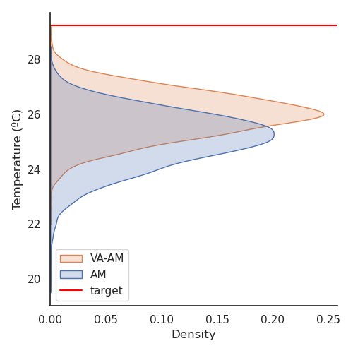
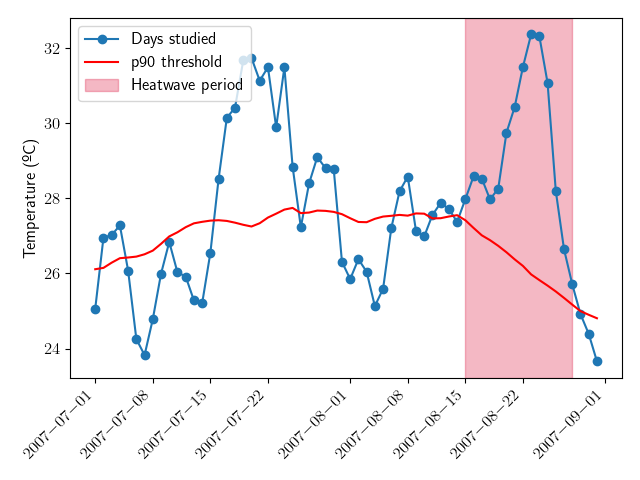
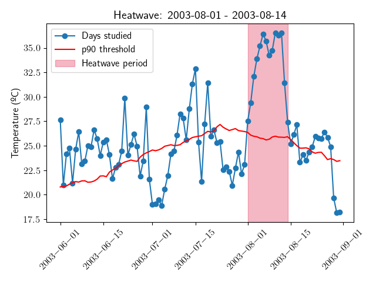
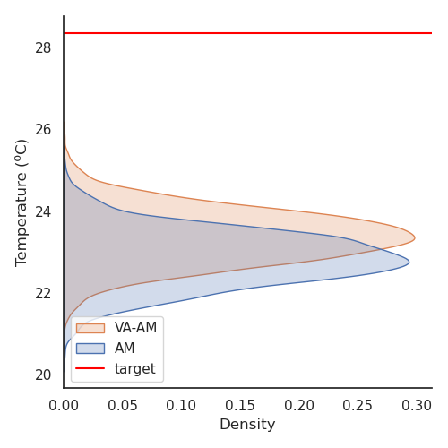

=======================================
Welcome to va_am's documentation!
=======================================

|img1| |img2| |img3| |img4|

.. .. |img5| image:: /auto_examples/images/thumb/sphx_glr_plot_image_robust_thumb.png
..     :width: 200px
..     :height: 200px

Description
===========

VA-AM (Various Advanced - Analogue Methods) is a Python package based on the deep learning enhancement of the classical statistical **Analogue Method**. It provides several
tools to analyse climatological **extreme events**, particularly **heat waves** (HW from now on).

It alows you to perform the
identification of the HW following `Russo index <https://iopscience.iop.org/article/10.1088/1748-9326/10/12/124003>`_, use the classical
`Analogue Method <https://journals.ametsoc.org/view/journals/clim/12/8/1520-0442_1999_012_2474_tamaas_2.0.co_2.xml>`_, use the enhanced Autoencoder Analogue Method, and even define own/use diferent deep learning architectures for
the Analogue search.

The source code is available at `github <https://github.com/cosminmarina/va_am>`_.
If you find any bugs/issues or have any suggestions, please open an `issue <https://github.com/cosminmarina/va_am/issues/new>`_.

We strongly recommend that you take a look at the :doc:`How to <how_to>` section to learn how to use the method, structure a configuration file, etc.

Installation
============
Latest version:

Using `pip`

.. code-block:: bash

    pip install va_am

Using `conda`

.. code-block:: bash

    conda install -c conda-forge va_am

Latest commit:

.. code-block:: bash

    pip install git+https://github.com/cosminmarina/va_am

Getting Started
===============

VA-AM can be used inside a python code as library, or directly outside of the code, as a executable. See both options:

Outside of code
***************

A quick way of using it directly from your terminal. First try the ``-h`` | ``--help`` flag as:

.. code-block::

    python -m va_am -h

.. hint::

    You should obtain something like:
    ::

        usage: __main__.py [-h] [-i] [-m METHOD] [-f CONF] [-sf SECRET] [-v] [-t]
                   [-p PERIOD] [-sr]

        optional arguments:
        -h, --help            show this help message and exit
        -i, --identifyhw      Flag. If true, first, identify the heatwave period
                                and, then, apply the 'method' if is one of: 'days',
                                'seasons', 'execs', 'latents', 'seasons-execs',
                                'latents-execs' or 'latents-seasons-execs'
        -m METHOD, --method METHOD
                                Specify an method to execute between: 'day' (default),
                                'days', 'seasons', 'execs', 'latents', 'seasons-execs',
                                'latents-execs' or 'latents-seasons-execs'
        -f CONF, --configfile CONF
                                JSON file with configuration of parameters. If not
                                specified and 'method' require the file, it will be
                                searched at 'params.json'
        -sf SECRET, --secretfile SECRET
                                Path to TXT file with needed information of the
                                Telegram bot to use to WARN and advice about
                                Exceptions. If not specified and 'method' require the
                                file, it will be searched at 'secret.txt'
        -v, --verbose         Flag. If true, overwrite verbose param.
        -t, --teleg           Flag. If true, exceptions and warnings will be sent to
                                Telegram Bot.
        -p PERIOD, --period PERIOD
                                Specify the period where to perform the operations
                                between: 'both' (default), 'pre' or 'post'
        -sr, --savereconstruction
                                Flag. If true, the reconstruction per iteration would
                                be saved in ./../../data/ folder as an
                                reconstruction-[name]-[day]-[period]-[AM/VA-AM].nc
                                file.

Inside of code
**************

You can import :doc:`va_am <va_am>` as a library in your code and use the equivalent method:

.. code-block:: python

    from va_am import va_am

    # Perform Autoencoder Analogue search with default args
    va_am()

or 

.. code-block:: python

    import va_am

    # Perform Autoencoder Analogue search with default args
    va_am.va_am()

.. note::

    The arguments of ``va_am()`` method are the same as the outside of code version. For more details see the :doc:`API reference <va_am>`.

Contents
========

.. toctree::
   :maxdepth: 2

   API Reference <modules>
   How to <how_to>
   License <license>
   Changelog <https://github.com/cosminmarina/va_am>

Indices and tables
==================

* :ref:`genindex`
* :ref:`modindex`
* :ref:`search`
